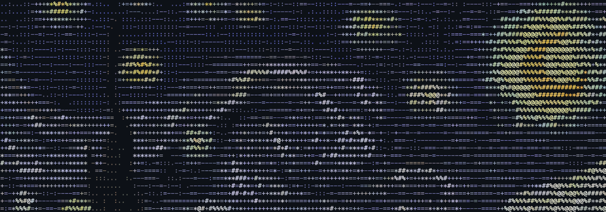

# Shuoren Li · Research × Engineering

[**打开作品集 ↗**](https://leo984357.github.io/)

李硕仁的个人网站，整理了金融数据分析、量化研究项目和实习经历。使用原生 HTML、CSS 和 JavaScript，托管在 GitHub Pages。



## 体验

- **流动的 ASCII 星空**：以多帧字符画循环播放星云旋涡和光带，月亮保持稳定；可暂停、继续，系统设置减少动态效果时默认静止。
- **快捷导航**：`⌘ K` / `Ctrl K` 搜索项目和页面，支持方向键、Enter、Esc 与焦点恢复。
- **项目筛选**：按数据工程、量化研究和 Agent 工具浏览三个精选项目。
- **真实成果**：委托理财工作台使用公开脱敏样例，16 家公司、4,372 条记录，基准日 2026-08-25。QMT 展示研究流程和模拟执行；基金投研提供合成案例。
- **渐进增强**：正文、链接、图片不依赖 JavaScript；支持键盘操作、系统减少动态效果设置、手机屏幕和无脚本阅读。

## 本地运行

```bash
python3 -m http.server 8000
```

访问 <http://localhost:8000>。原生 HTML / CSS / JavaScript，无构建流程和第三方运行时依赖。

| 文件 | 内容 |
| --- | --- |
| [index.html](index.html) | 页面结构、项目事实、链接与分享信息 |
| [style.css](style.css) | 视觉系统、响应布局、交互与无障碍样式 |
| [script.js](script.js) | ASCII 星空、快捷导航、筛选、滚动反馈 |
| [assets/](assets/) | 字符画、真实工作台截图、图标 |
| [404.html](404.html) | 页面不存在时的返回入口 |

画作来源和生成说明见 [ARTWORK.md](assets/ARTWORK.md)。背景画以等宽字符构成，SVG 不含位图；动画帧保存在 JSON 中，PNG 是静态字符画的社交分享预览。页面中的项目流程面板为工作流程示意。
